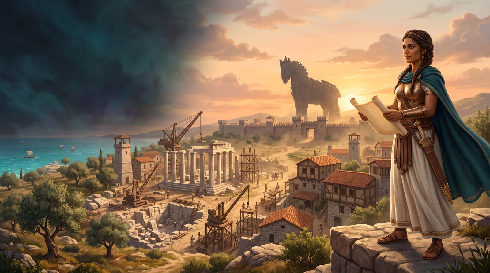

# 🏛️ TROY 120

Play as Lyra and build Troy in **two minutes**: gather supplies, complete missions, and fight raiders. Move with **left stick / WASD**, build with **A / E**, and attack with **X / F**. Defeat the boss who arrives with **30 seconds left** before time runs out. Even victory ends with the Trojan Horse destroying your city, but your XP and collected weapons carry into the next attempt.

**Build a city. Defy the odds. Trust no horse.**

A 3D browser game built for the **{Tech: Europe} AI Gaming Hack in Paris**, combining city building, survival combat, and companions you can talk to.

🎮 [Play TROY 120](https://troy-120.vercel.app) · [Run locally](#-running-the-project) · [Full gameplay guide](docs/GAMEPLAY.md)

Open the game in your browser and start playing—no account required. Xbox controllers and keyboard controls are supported.

<p align="center">
  
  <br />
  <em>Generated cover artwork.</em>
</p>

## 🎮 How to Play

View the **Xbox** or **Keyboard** guide on the opening screen, then select **Play Troy**. Lyra explains the mission during the first ten seconds. Build as much as you can to earn renown, defend yourself, and defeat the Warlord before the countdown ends.

| Action | Xbox controller | Keyboard / mouse |
| --- | --- | --- |
| Move | Left stick | WASD / arrow keys |
| Look around | Right stick | Drag the mouse |
| Sprint | RT / left-stick click | Shift |
| Gather, collect loot, or open building choices | A | E |
| Attack | X | F / Space |
| Dodge | B | C |
| Switch weapons | LB / RB | Q / R |
| Talk to a companion | Y | T |
| View missions | D-pad up | Tab |
| Pause, see controls, or exit | Menu | Escape |

Connect an Xbox controller by USB or Bluetooth, then press and release a button for browser detection. Use the D-pad or left stick to select menu items, **A** to confirm, and **B** to go back.

Building choices, conversations, and pause menus stop the clock. If the microphone is unavailable, type a message or choose a suggested order.

## 🧰 Technologies

- **Game and interface:** `Three.js`, `React 19`, `TypeScript`, `Tailwind CSS`
- **Application and hosting:** `Next.js`, `Vercel`; `vinext`, `Vite`, and `Sites` for the original Cloudflare build
- **Campaign storage:** private `Vercel Blob` on Vercel; `Cloudflare D1` / `SQLite` and `Drizzle ORM` on Sites
- **AI conversations and artwork:** `Google Gemini`
- **Music and voices:** `Google Lyria`, `Gradium`
- **Browser input:** `Gamepad API`, browser speech recognition

## ✨ Features

Here is what TROY 120 can do:

- **🏗️ Build your city:** Choose houses, timber yards, cannon towers, or temples. Complete contracts to earn materials and keep expanding.

- **⚔️ Survive the siege:** Fight skirmishers, archers, and brutes. Dodge their attacks and face the Achaean Warlord in the final thirty seconds.

- **🏹 Collect your loadout:** Some defeated enemies drop weapons. Start with a sword and unlock a bow and heavy hammer, with a maximum of three weapon types.

- **💥 Defend with cannons:** Towers aim, fire visible shells, and damage raiders when those shells land.

- **🗣️ Command your companions:** Say “Theron, fight the raiders” or “Mira, build houses.” They carry out accepted orders when play resumes, using the same resources and combat rules as the rest of the game.

- **🌍 Explore changing cities:** Progress through four city themes with different layouts, landmarks, and increasingly difficult raids, up to a difficulty cap.

- **🏆 Keep growing:** Earn XP and climb from Recruit to Immortal. Completed attempts save XP and weapon unlocks even after defeat; clearing a city also banks renown and advances the campaign.

- **🐴 Expect the inevitable:** Even victory ends with Troy’s destruction. Four horse finales make the last moments unpredictable before your next city begins.

## 🧪 The Process

The game revolves around one short loop: **gather → build → defend → survive → rebuild**. The two-minute deadline makes each choice matter, while permanent XP and weapon unlocks give every completed attempt a purpose.

Three.js creates the playable city, characters, buildings, and combat effects. Gemini-generated artwork and Lyria music are bundled with the project, alongside Lyra’s Gradium opening briefing. Live Gemini conversations and Gradium replies add character interaction when provider keys are configured.

Companion dialogue connects to a limited set of game actions: fight, build, or follow. The game validates those orders and applies normal costs. Campaign saves use server validation and duplicate-run protection so retrying a save does not award XP twice.

## 📚 What I Learned

- **🎯 Short rounds need variety:** Different cities, enemy roles, weapon choices, and finales give players more decisions within the same time limit.
- **🎮 Controls are part of onboarding:** A simple guide on both the opening and pause screens helps players start quickly and recover when they forget a button.
- **🗣️ AI needs clear boundaries:** Conversations feel useful when companions can perform specific, understandable actions within the game’s rules.
- **💾 Progress needs reliable saves:** Persistent rewards matter only when completed runs save correctly, including retries after connection failures.

## 🚧 How It Can Be Improved

- Add more city themes, contracts, bosses, and enemy attack patterns.
- Expand companion personalities and tactical orders.
- Playtest difficulty and accessibility with more players and physical controllers.
- Explore cooperative play and shared city defense.

## 🎬 Quick Demo

### 1. Start your expedition

Choose your control guide and start a run. Listen to Lyra’s short briefing while exploring the city.

### 2. Build your first house

Walk to an empty plot and press **A / E**. Choose a Trojan house. Completing the first building contract rewards more supplies for your next construction.

### 3. Call for help

Press **Y / T** and ask a companion to fight or build. Resume the game to see the order take effect. Add a cannon tower and watch its shells hit nearby raiders.

### 4. Face the Warlord

With **0:30 remaining**, the boss arrives. Defeat him before **0:00** and stay alive. The horse finale then destroys the city, your victory saves, and the next expedition opens with your accumulated XP and weapons.

## 🏗️ Architecture

| Layer | Role |
| --- | --- |
| React interface | Start and pause menus, controls, HUD, dialogue, building choices |
| Three.js game engine | City generation, movement, combat, companions, animations |
| Server API routes | Dialogue validation, voice requests, campaign saves |
| Private Vercel Blob / Cloudflare D1 | XP, ranks, weapon unlocks, scores, and city progression, using the storage for each host |
| Bundled media | Cover art, portraits, textures, music, and opening narration |

## 🔌 API Overview

| Method | Route | Description |
| --- | --- | --- |
| GET | `/api/troy/progress` | Load the current campaign |
| POST | `/api/troy/progress` | Validate and save a completed attempt once |
| POST | `/api/troy/converse` | Get contextual dialogue and validated companion orders |
| POST | `/api/voice` | Generate a spoken reply with Gradium |
| GET | `/api/status` | Report which provider keys are configured |

## 🚀 Running the Project

### Prerequisites

- **Node.js 22.13 or newer** and npm
- A browser with **WebGL** support
- Optional: an Xbox controller, microphone, and provider API keys

### Installation

```bash
git clone https://github.com/MeohamedYassineAgourram/Odyssey.git
cd Odyssey
npm install
npm run dev
```

Open the URL printed in your terminal. The development server provides a local D1 database and initializes campaign tables on first use.

### Optional live AI

The core game and bundled media work without provider keys. For live AI conversations and spoken replies, copy `.env.example` to `.env` **only if `.env` does not already exist**, then set:

```dotenv
GEMINI_API_KEY=your_google_api_key
GRADIUM_API_KEY=your_gradium_api_key
```

Restart the development server after editing the file. Keys stay on the server, and `.env` is ignored by Git. Without configured providers, the game offers local dialogue and browser speech fallbacks. Microphone transcription depends on browser support.

### Development checks

```bash
npm test
npm run typecheck
npm run lint
npm run build
```

Tests cover gameplay rules, progression, saves, API contracts, and simulated controller input. They do not replace physical controller playtesting.

## 📁 Project Structure

```text
app/
├── page.tsx             # Game interface and menus
├── globals.css          # Visual styling
├── troy/                # City, rules, combat, progression, and controls
├── oracle/              # Shared character models and controller support
└── api/                 # Campaign, dialogue, voice, and provider routes
db/                      # Database schema and campaign persistence
drizzle/                 # Database migrations
public/
├── troy/                # Troy cover and narration
└── oracle/              # Shared portraits, textures, and music
scripts/                 # Asset generation and development utilities
tests/                   # Automated checks
docs/                    # Gameplay, integrations, and asset provenance
```

## 🤝 Hackathon Partners

Built for the **{Tech: Europe} AI Gaming Hack**, co-hosted by **Google DeepMind** and **Voodoo**, with **Cognition**, **YG**, and **Gradium** as event partners.

**Google** powers live dialogue and generated artwork/music; **Gradium** powers narration and spoken replies. Voodoo and YG are acknowledged as event partners. A retained Cognition/Devin adapter is not connected to Troy’s gameplay. See the [integration details](docs/SPONSORS.md).

## 📄 Documentation

- [Gameplay and technical guide](docs/GAMEPLAY.md) — building costs, combat, progression, controls, and save behavior
- [Sponsor integrations](docs/SPONSORS.md) — provider roles and current integration status
- [Asset provenance](docs/ASSETS.md) — generated media and generation scripts
- [Opening briefing manifest](public/troy/briefing-manifest.json) — narration text and generation details
- [Vercel deployment guide](docs/DEPLOYMENT.md) — hosting, private campaign storage, and release checks

## 👥 Contributors

- [Mohamed Yassine Agourram](https://github.com/MeohamedYassineAgourram)
- [CHENLongyeLucien](https://github.com/CHENLongyeLucien) — documentation contribution
